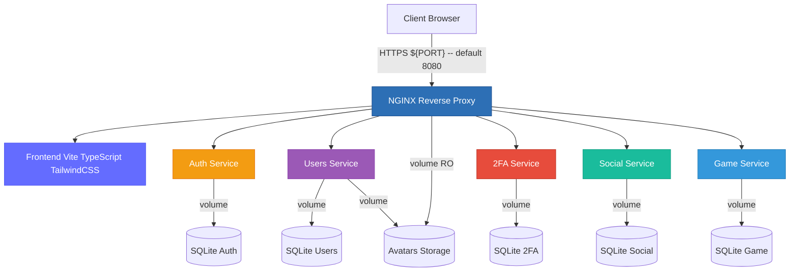
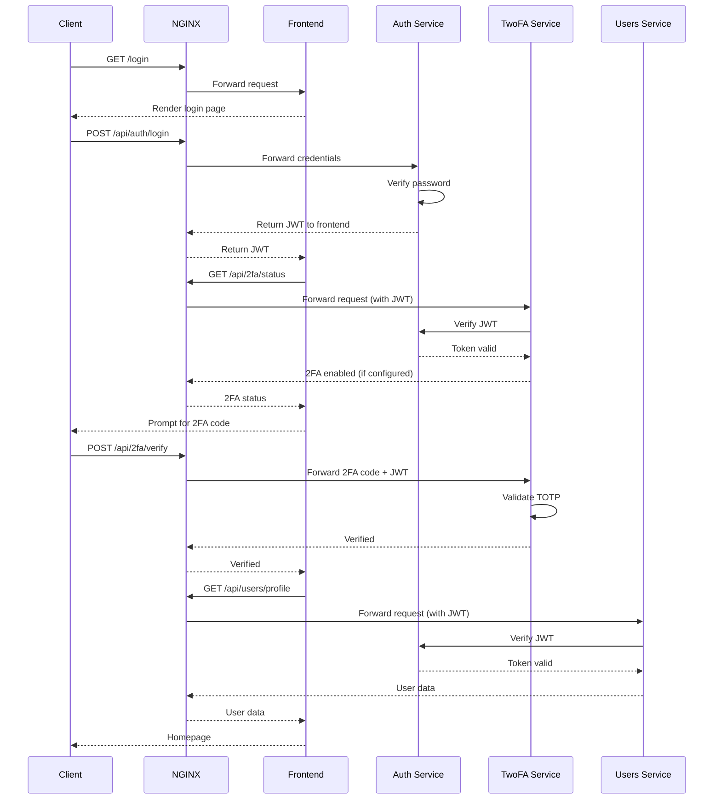
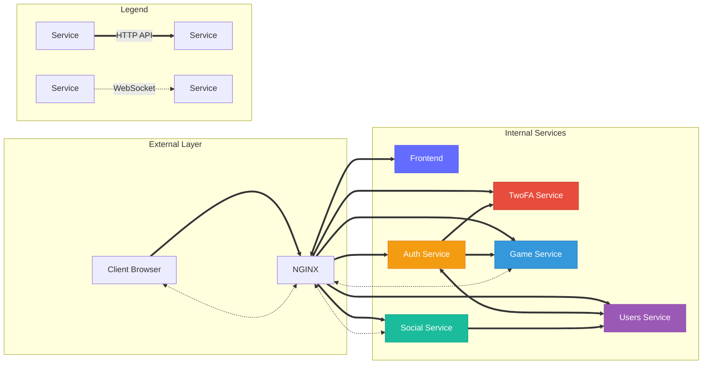

# Microservices Architecture - ft_transcendence

> **Note**: The diagrams below are automatically rendered by GitHub.  
> If you don't see them, make sure you're on github.com (not in raw mode).

## Architecture Overview



## Services

### NGINX (Reverse Proxy)

- **Exposed port**: ${PORT}
- **Role**: Single entry point, SSL/TLS management, request routing
- **Dependencies**: All backend services
- **Volumes**: Avatars (read-only)
- **Secrets**: SSL certificates (cert. pem, key.pem)
- **Configuration**: Uses environment variables for service URLs

### Frontend

- **Technology**: Vite + TypeScript + TailwindCSS
- **Internal port**: 3000
- **Role**: User interface (SPA)
- **Dependencies**: None (base service)

### Auth Service

- **Internal port**: 3000
- **Role**: Authentication and session management (JWT), admin validation
- **Volumes**: SQLite (db_auth_data volume)
- **Dependencies**: Frontend

### Users Service

- **Internal port**: 3000
- **Role**: User profile management
- **Volumes**: Avatars (read/write), db_users_data, SQLite (db_users_data volume)
- **Dependencies**: Frontend, Auth

### 2FA Service

- **Internal port**: 3000
- **Role**: Two-factor authentication (TOTP)
- **Volumes**: SQLite (db_2fa_data volume)
- **Dependencies**: Auth, Users

### Social Service

- **Internal port**: 3000
- **Role**: Friend relationships, presence tracking, real-time notifications via WebSocket
- **Volumes**: SQLite (db_social_data volume)
- **Dependencies**: Frontend, Auth, Users

### Game Service

- **Internal port**: 3000
- **Role**: Pong game logic, matchmaking, real-time gameplay via WebSocket
- **Volumes**: SQLite (db_game_data volume)
- **Dependencies**: Frontend

## Authentication Flow



## Service Dependencies and Communication



### Communication Patterns

**1. Client → Services (via NGINX)**

- All HTTP/HTTPS requests go through NGINX reverse proxy
- NGINX routes based on URL path (`/api/auth/*`, `/api/users/*`, etc.)
- NGINX uses environment variables for service URLs (e.g., `${AUTH_SERVICE_URL}`)
- WebSocket connections for real-time communication (Social: friend notifications, Game: gameplay)

**2. Service-to-Service Communication**

Services communicate via internal Docker network (`backend`) using REST API calls with API Key authentication (`INTERNAL_API_SECRET`).

#### Internal API Reference

| From Service | To Service       | Authentication | Endpoint                               | Purpose                                                   |
| ------------ | ---------------- | -------------- | -------------------------------------- | --------------------------------------------------------- |
| **Auth**     | **Game**         | API Key        | `/api/game/internal/cleanup/:id`       | Clear game websockets if logout during game or tournament |
| **Auth**     | **Users**        | API Key        | `POST /api/internal/users/new-user`    | Create new user after registration                        |
| **Auth**     | **2FA**          | API Key        | `POST /api/internal/2fa/verify`        | Verify 2FA code                                           |
| **Auth**     | **2FA**          | API Key        | `POST /api/internal/2fa/setup`         | Setup 2FA for user                                        |
| **Auth**     | **2FA**          | API Key        | `POST /api/internal/2fa/disable`       | Disable 2FA for user                                      |
| **Auth**     | **2FA**          | API Key        | `POST /api/internal/2fa/status`        | Get 2FA status                                            |
| **Social**   | **Users**        | API Key        | `GET /api/internal/users/profile/:id`  | Get user profile data                                     |
| **Social**   | **Users**        | API Key        | `PATCH /api/internal/users/:id/status` | Update user online/offline status                         |
| **Users**    | **Auth**         | API Key        | `GET /api/internal/2fa/status/:id`     | Get 2FA status for user profile                           |
| **Frontend** | **All Services** | JWT            | All `/api/*` public endpoints          | User authentication                                       |

**Note**: The **Game** service operates independently and does not make internal API calls to other services.

**3. Admin Authentication**

- Admin validation is handled by Auth service
- `/stub_status` endpoint (NGINX metrics) is restricted to internal networks only

**4. Data Persistence**

- Each service has its own isolated SQLite database (database per service pattern)
- Databases stored in Docker volumes for persistence
- Avatars shared between Users (RW) and NGINX (RO)

**5. Real-time Communication**

- **Social Service WebSocket**: Friend request notifications, presence updates (online/offline status)
- **Game Service WebSocket**: Real-time game state synchronization, player movements, score updates

## Services Summary

| Service      | Port | Technology                                 | Database        | Main Role                            |
| ------------ | ---- | ------------------------------------------ | --------------- | ------------------------------------ |
| **NGINX**    | 8080 | Nginx                                      | -               | Reverse proxy, SSL/TLS, static files |
| **Frontend** | 3000 | Vite + TypeScript + TailwindCSS            | -               | User interface (SPA)                 |
| **Auth**     | 3000 | Node.js + TypeScript + Fastify             | SQLite (volume) | JWT Authentication, admin validation |
| **Users**    | 3000 | Node. js + TypeScript + Fastify            | SQLite (volume) | Profile management                   |
| **2FA**      | 3000 | Node.js + TypeScript + Fastify             | SQLite (volume) | Two-factor auth (TOTP)               |
| **Social**   | 3000 | Node.js + TypeScript + Fastify + WebSocket | SQLite (volume) | Friends, presence, notifications     |
| **Game**     | 3000 | Node.js + TypeScript + Fastify + WebSocket | SQLite (volume) | Pong game, real-time gameplay        |

## Environment Variables

The NGINX configuration requires the following environment variables for service URLs:

```bash
# Service URLs for NGINX routing
AUTH_SERVICE_URL=http://auth:3000
USERS_SERVICE_URL=http://users:3000
TWOFA_SERVICE_URL=http://2fa:3000
SOCIAL_SERVICE_URL=http://social:3000
GAME_SERVICE_URL=http://game:3000
```

These variables allow dynamic service routing and are substituted at container startup.

## Exposed Endpoints

```
https://localhost:8080/
├── /                       → Frontend (Vite SPA)
├── /api/auth/*             → Auth Service (login, logout, verify)
├── /api/users/*            → Users Service (profile, avatars)
├── /api/2fa/*              → 2FA Service (setup, verify)
├── /api/social/*           → Social Service (friends, requests)
│   └── /api/social/ws      → WebSocket (friend notifications, presence)
├── /api/game/*             → Game Service (matchmaking, game state)
│   └── /api/game/ws        → WebSocket (real-time gameplay)
├── /avatars/*              → Static avatars (NGINX serves from volume)
├── /auth/docs/             → Auth API documentation (admin only)
├── /users/docs/            → Users API documentation (admin only)
├── /2fa/docs/              → 2FA API documentation (admin only)
├── /social/docs/           → Social API documentation (admin only)
├── /game/docs/             → Game API documentation (admin only)
└── /stub_status            → NGINX metrics (internal network only)
```

## Networks

- **backend**: Main network for inter-service communication and monitoring
- **monitoring**: Dedicated network for monitoring stack (Prometheus, Grafana, AlertManager)

## Persistent Volumes

| Volume            | Usage                                   | Services               | Access |
| ----------------- | --------------------------------------- | ---------------------- | ------ |
| `db_auth_data`    | Authentication data (SQLite)            | Auth                   | RW     |
| `db_users_data`   | User profiles (SQLite)                  | Users                  | RW     |
| `db_social_data`  | Friend relationships, presence (SQLite) | Social                 | RW     |
| `db_2fa_data`     | 2FA secrets (SQLite)                    | 2FA                    | RW     |
| `db_game_data`    | Game history (SQLite)                   | Game                   | RW     |
| `avatars_data`    | Avatar images                           | Users (RW), NGINX (RO) | Mixed  |
| `prometheus_data` | Metrics time-series database            | Prometheus             | RW     |
| `grafana_data`    | Dashboards and configuration            | Grafana                | RW     |

## Healthchecks

All Node.js services use a TCP healthcheck on port 3000:

- **Interval**: 5-30s
- **Timeout**: 3s
- **Retries**: 5-12
- **Start period**: 10-20s

NGINX has an HTTP healthcheck on port 8080.

Monitoring services have HTTP healthchecks:

- **Prometheus**: Port 9090
- **Grafana**: Port 3000
- **AlertManager**: Port 9093

## Startup Order

1. **Frontend** (base service, no dependencies)
2. **Auth** (depends on Frontend)
3. **Users** (depends on Frontend + Auth)
4. **2FA** (depends on Auth + Users)
5. **Social** (depends on Frontend + Auth + Users)
6. **Game** (depends on Frontend)
7. **Prometheus** (depends on Auth + Users for scraping)
8. **AlertManager** (depends on Prometheus)
9. **Grafana** (depends on Prometheus)
10. **NGINX Exporter** (depends on NGINX)
11. **NGINX** (depends on all services)

## Getting Started

### Prerequisites

Ensure you have the required environment variables configured:

```bash
# Verify environment setup
make verif-env
```

### Build the application

```bash
# Build all services (includes monitoring stack)
make build
```

### Start the application

```bash
# Start all services in detached mode (includes monitoring)
make up
```

This command will:

- Verify environment variables
- Start all Docker containers including monitoring stack
- Services will be accessible at `https://localhost:8080`

### Development mode

For development with hot-reload:

```bash
# Build development environment
make dev-build

# Start in development mode
make dev-up
```

### Stop the application

```bash
# Stop all services
make down
```

## Useful Commands

### View logs from specific services

```bash
# View NGINX logs
make logs-nginx

# View Frontend logs
make logs-frontend

# View Auth service logs
make logs-auth

# View Users service logs
make logs-users

# View 2FA service logs
make logs-2fa

# View Social service logs
make logs-social

# View Game service logs
make logs-game

# View monitoring logs
make logs-prometheus
make logs-grafana
make logs-alertmanager
```

### Access service shell

```bash
# Access NGINX shell
make sh-nginx

# Access Frontend shell
make sh-frontend

# Access Auth shell
make sh-auth

# Access Users shell
make sh-users

# Access monitoring shells
make sh-prometheus
make sh-grafana
```

### Code formatting

```bash
# Format code
make format

# Check formatting
make format-check
```

### Run tests

```bash
# Run all tests
make test
```

This command will:

- Stop any running services
- Build fresh containers
- Run the test suite
- Clean up after tests

### Debug mode

Run services with logs visible in the console:

```bash
# Start in debug mode with console logs
make debug
```

## Database Management

### Reset all databases

**Warning**: This will delete all data in volumes.

```bash
# Stop services and remove all volumes
make reset-db
```

After resetting, rebuild and restart:

```bash
make build
make up
```

## Development Workflow

### Initial setup

```bash
# Install dependencies and hooks
make install

# Build the project
make build

# Start services
make up
```

### Daily development

```bash
# Start development mode
make dev-up

# View logs
make logs-frontend
make logs-auth

# Access a service shell
make sh-users
```

### Before committing

```bash
# Check code formatting
make format-check

# Run tests
make test
```

## Monitoring

This project includes a complete monitoring stack with Prometheus, Grafana and AlertManager integrated into the main build.

See **[monitoring.md](./monitoring.md)** for the complete monitoring architecture documentation.

**Monitoring is now included by default** when you run:

```bash
# Start application with monitoring
make up

# Access monitoring interfaces (admin authentication required)
# - Grafana: https://localhost:8080/grafana/
# - Prometheus: https://localhost:8080/prometheus/
# - AlertManager: https://localhost:8080/alertmanager/
```

## Troubleshooting

### Services won't start

```bash
# Check environment variables
make verif-env

# Rebuild containers
make build

# Try starting again
make up
```

### Port conflicts

If port 8080 is already in use, modify the `PORT` variable in your `.env` file:

```bash
PORT=8081
```

### Database issues

```bash
# Reset all databases
make reset-db

# Rebuild and restart
make build
make up
```

### View service status

```bash
# Check running containers
docker ps

# View logs for debugging
make logs-nginx
make logs-frontend
```

## Architecture Principles

This architecture follows microservices best practices:

- Separation of concerns
- Database per service pattern
- API-based communication with API Key authentication for internal services
- Centralized gateway (NGINX) with parameterized routing
- Health monitoring on all services
- Container orchestration with Docker Compose
- Environment-based configuration
- Automated testing pipeline
- Integrated monitoring stack

```

```
