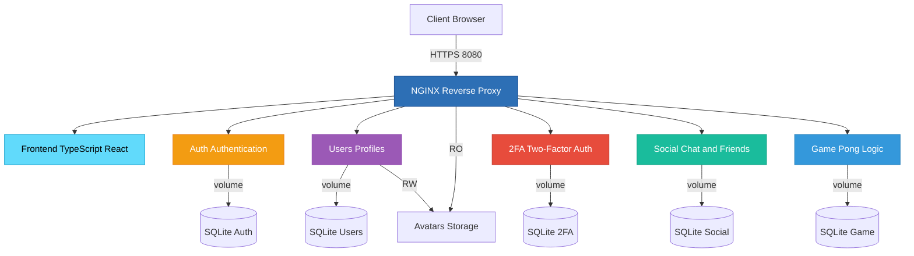
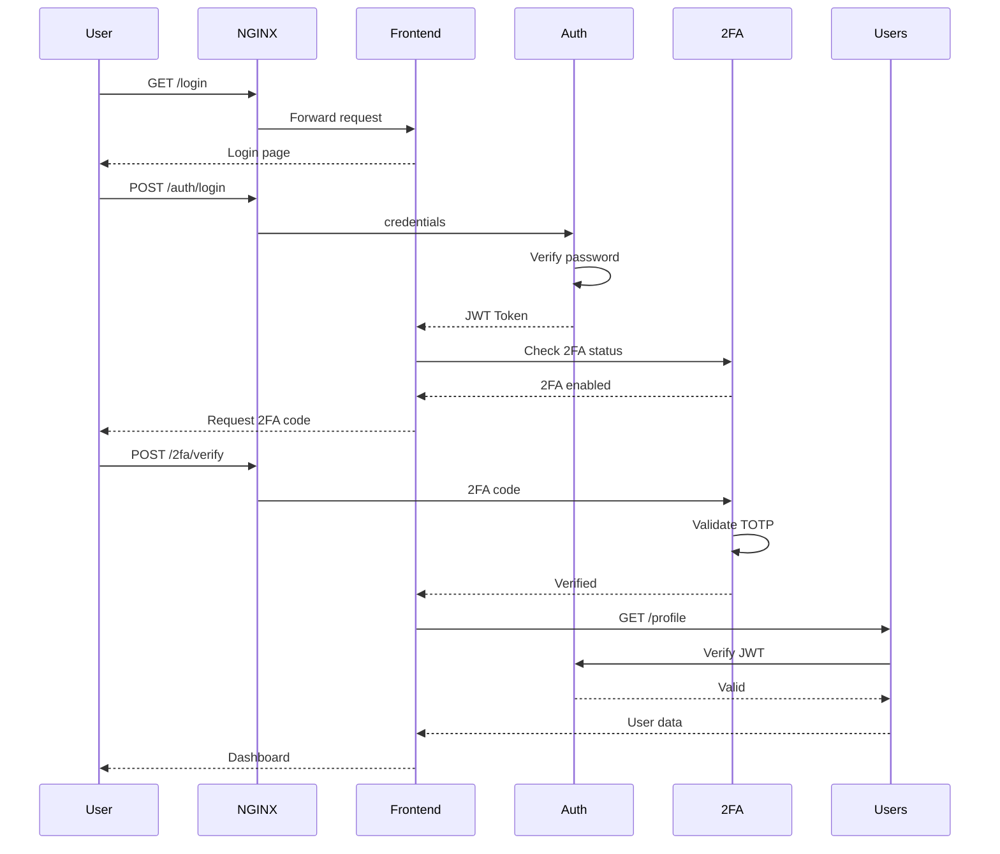
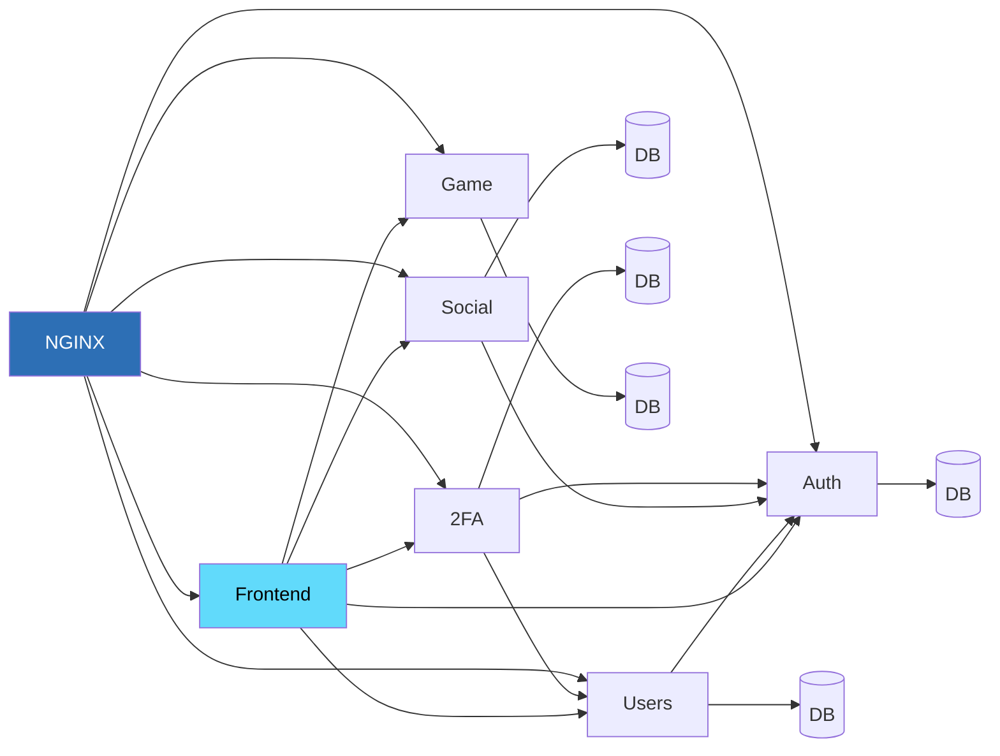

# Microservices Architecture - ft_transcendence

> **Note**:   The diagrams below are automatically rendered by GitHub.     
> If you don't see them, make sure you're on github.com (not in raw mode).

## Architecture Overview



## Services

### NGINX (Reverse Proxy)
- **Exposed port**: 8080
- **Role**: Single entry point, SSL/TLS management, request routing
- **Dependencies**: All backend services
- **Volumes**:  Avatars (read-only)
- **Secrets**: SSL certificates (cert.pem, key.pem)

### Frontend
- **Technology**: TypeScript/React
- **Internal port**: 3000
- **Role**: User interface
- **Dependencies**: None (base service)

### Auth Service
- **Internal port**: 3000
- **Role**: Authentication and session management
- **Database**: SQLite (db_auth_data)
- **Dependencies**: Frontend

### Users Service
- **Internal port**: 3000
- **Role**: User profile management
- **Database**: SQLite (db_users_data)
- **Volumes**: Avatars (read/write)
- **Dependencies**: Frontend, Auth

### 2FA Service
- **Internal port**:  3000
- **Role**:  Two-factor authentication
- **Database**: SQLite (db_2fa_data)
- **Dependencies**:  Auth, Users

### Social Service
- **Internal port**: 3000
- **Role**: Social features (friends, messages, etc.)
- **Database**: SQLite (db_social_data)
- **Dependencies**: Frontend, Auth

### Game Service
- **Internal port**: 3000
- **Role**:  Pong game logic, matchmaking
- **Database**: SQLite (db_game_data)
- **Dependencies**: Frontend

## Authentication Flow



## Service Dependencies



## Services Summary

| Service | Port | Technology | Database | Main Role |
|---------|------|------------|----------|-----------|
| **NGINX** | 8080 | Nginx | - | Reverse proxy, SSL/TLS |
| **Frontend** | 3000 | TypeScript/React | - | User interface |
| **Auth** | 3000 | Node.js/TypeScript | SQLite | JWT Authentication |
| **Users** | 3000 | Node.js/TypeScript | SQLite | Profile management |
| **2FA** | 3000 | Node. js/TypeScript | SQLite | Two-factor authentication |
| **Social** | 3000 | Node.js/TypeScript | SQLite | Chat, friends |
| **Game** | 3000 | Node.js/TypeScript | SQLite | Pong game logic |

## Exposed Endpoints

```
https://localhost:8080/
├── /                    → Frontend (React SPA)
├── /api/auth/*          → Auth Service
├── /api/users/*         → Users Service
├── /api/2fa/*           → 2FA Service
├── /api/social/*        → Social Service
├── /api/game/*          → Game Service
└── /avatars/*           → Static avatars (NGINX)
```

## Networks

- **backend**: Main network for inter-service communication
- **pong**:  Dedicated network (potentially for game)

## Persistent Volumes

| Volume | Usage | Services |
|--------|-------|----------|
| `db_auth_data` | Authentication data | Auth |
| `db_users_data` | User data | Users |
| `db_social_data` | Social data | Social |
| `db_2fa_data` | 2FA data | 2FA |
| `db_game_data` | Game data | Game |
| `avatars_data` | Avatar images | Users (RW), NGINX (RO) |

## Healthchecks

All Node.js services use a TCP healthcheck on port 3000:
- **Interval**: 5-30s
- **Timeout**: 3s
- **Retries**:  5-12
- **Start period**: 10-20s

## Startup Order

1. **Frontend** (base service)
2. **Auth** (depends on Frontend)
3. **Users** (depends on Frontend + Auth)
4. **2FA** (depends on Auth + Users)
5. **Social** (depends on Frontend + Auth)
6. **Game** (depends on Frontend)
7. **NGINX** (depends on all services)

## Getting Started

### Prerequisites

Ensure you have the required environment variables configured:

```bash
# Verify environment setup
make verif-env
```

### Build the application

```bash
# Build all services
make build
```

### Start the application

```bash
# Start all services in detached mode
make up
```

This command will:
- Verify environment variables
- Start all Docker containers
- Services will be accessible at `https://localhost:8080`

### Development mode

For development with hot-reload:

```bash
# Build development environment
make dev-build

# Start in development mode
make dev-up
```

### Stop the application

```bash
# Stop all services
make down
```

## Useful Commands

### View logs from specific services

```bash
# View NGINX logs
make logs-nginx

# View Frontend logs
make logs-frontend

# View Auth service logs
make logs-auth

# View Users service logs
make logs-users

# View 2FA service logs
make logs-2fa

# View Social service logs
make logs-social

# View Game service logs
make logs-game
```

### Access service shell

```bash
# Access NGINX shell
make sh-nginx

# Access Frontend shell
make sh-frontend

# Access Auth shell
make sh-auth

# Access Users shell
make sh-users
```

### Code formatting

```bash
# Format code
make format

# Check formatting
make format-check
```

### Run tests

```bash
# Run all tests
make test
```

This command will:
- Stop any running services
- Build fresh containers
- Run the test suite
- Clean up after tests

### Debug mode

Run services with logs visible in the console:

```bash
# Start in debug mode with console logs
make debug
```

## Database Management

### Reset all databases

**Warning**: This will delete all data in volumes. 

```bash
# Stop services and remove all volumes
make reset-db
```

After resetting, rebuild and restart:

```bash
make build
make up
```

## Development Workflow

### Initial setup

```bash
# Install dependencies and hooks
make install

# Build the project
make build

# Start services
make up
```

### Daily development

```bash
# Start development mode
make dev-up

# View logs
make logs-frontend
make logs-auth

# Access a service shell
make sh-users
```

### Before committing

```bash
# Check code formatting
make format-check

# Run tests
make test
```

## Monitoring

This project includes a complete monitoring stack with Prometheus, Grafana and AlertManager.  

See **[MONITORING.md](./MONITORING.md)** for the complete monitoring architecture documentation.

```bash
# Build monitoring stack
make build-monitoring

# Start with monitoring
make up-monitoring

# Access monitoring interfaces
# - Grafana: http://localhost:8080/grafana/
# - Prometheus: http://localhost:8080/prometheus/
```

## Troubleshooting

### Services won't start

```bash
# Check environment variables
make verif-env

# Rebuild containers
make build

# Try starting again
make up
```

### Port conflicts

If port 8080 is already in use, modify the `PORT` variable in your `.env` file:

```bash
PORT=8081
```

### Database issues

```bash
# Reset all databases
make reset-db

# Rebuild and restart
make build
make up
```

### View service status

```bash
# Check running containers
docker ps

# View logs for debugging
make logs-nginx
make logs-frontend
```

## Architecture Principles

This architecture follows microservices best practices: 
- Separation of concerns
- Database per service pattern
- API-based communication
- Centralized gateway (NGINX)
- Health monitoring on all services
- Container orchestration with Docker Compose
- Environment-based configuration
- Automated testing pipeline
```