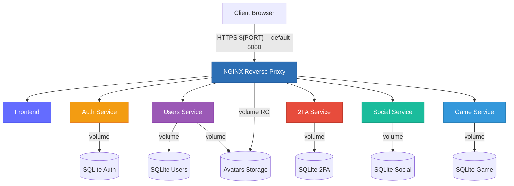
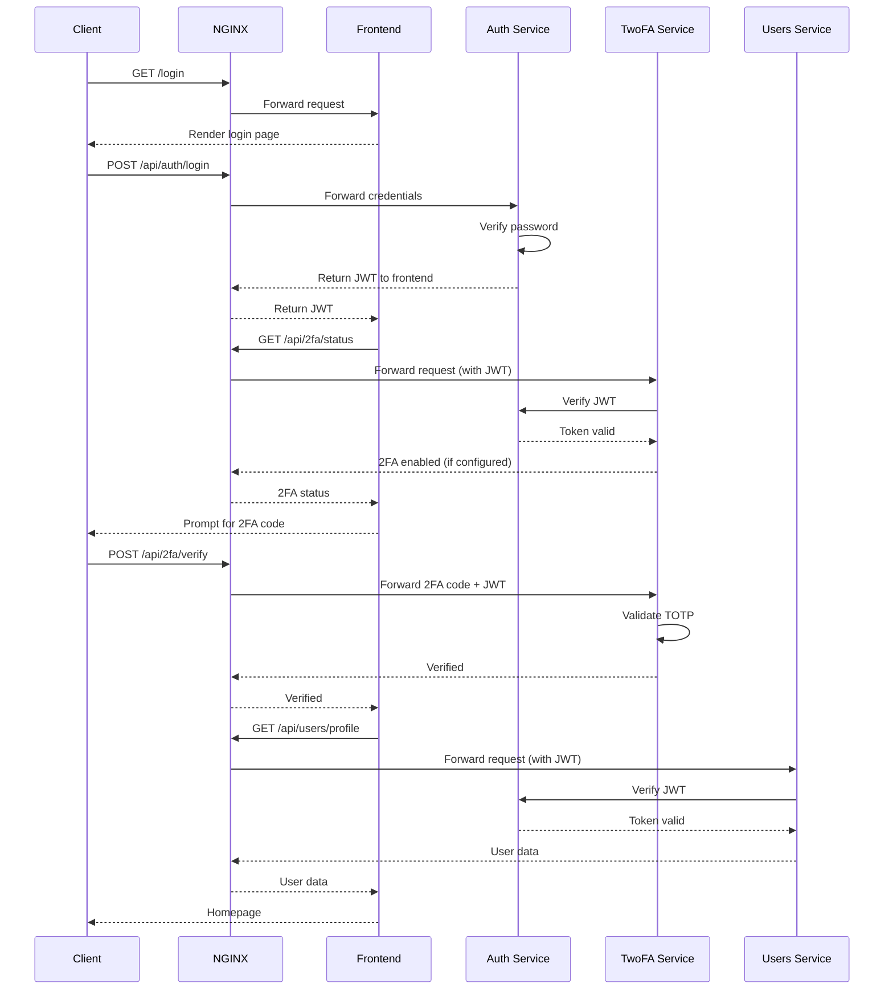
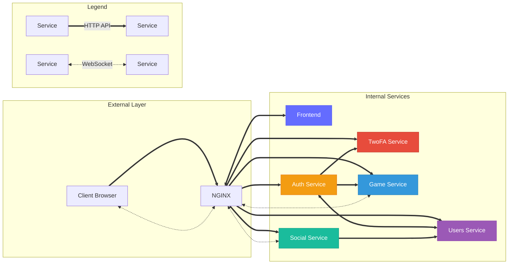

# Microservices Architecture - ft_transcendence

> **Note**: The diagrams below are automatically rendered by GitHub.  
> If you don't see them, make sure you're on github.com (not in raw mode).

## Architecture Overview

## Services

### NGINX (Reverse Proxy)

- **Exposed port**: ${PORT}
- **Role**: Single entry point, SSL/TLS management, request routing
- **Dependencies**: All backend services
- **Volumes**: Avatars (read-only)
- **Secrets**: SSL certificates (cert. pem, key.pem)
- **Configuration**: Uses environment variables for service URLs

### Frontend

- **Internal port**: 3000
- **Role**: User interface (SPA)
- **Dependencies**: None (base service)
- **Technology**: Vite + TypeScript + TailwindCSS

### Auth Service

- **Internal port**: 3000
- **Role**: Authentication and session management (JWT), admin validation
- **Volumes**: SQLite (db_auth_data volume)
- **Dependencies**: Frontend

### Users Service

- **Internal port**: 3000
- **Role**: User profile management
- **Volumes**: Avatars (read/write), db_users_data, SQLite (db_users_data volume)
- **Dependencies**: Frontend, Auth

### 2FA Service

- **Internal port**: 3000
- **Role**: Two-factor authentication (TOTP)
- **Volumes**: SQLite (db_2fa_data volume)
- **Dependencies**: Auth, Users

### Social Service

- **Internal port**: 3000
- **Role**: Friend relationships, presence tracking, real-time notifications
- **Volumes**: SQLite (db_social_data volume)
- **Dependencies**: Frontend, Auth, Users

### Game Service

- **Internal port**: 3000
- **Role**: Pong game logic, matchmaking, real-time gameplay
- **Volumes**: SQLite (db_game_data volume)
- **Dependencies**: Frontend

## Database

Using SQLite with Better-sqlite3 for efficient, file-based data storage.
SQLite is a file, so it has to lock it when writing to prevent data corruption.
Better-sqlite3 is synchronous, so each operation blocks the event loop until it completes.
There are some risks of using SQLite in a concurrent environment, especially with multiple instances of the service. It's not only for performance but also for data integrity and preventing database locks and crash.
The pragmas set here help manage how SQLite handles concurrency and performance:

- **WAL** : Write-Ahead Logging, writen to improve concurrency and performance in SQLite databases. Reading doesn't block writing and vice versa, allowing multiple operations to occur simultaneously.
- **NORMAL** : Balances performance and data integrity. It reduces the number of sync operations to disk, improving speed while still providing a reasonable level of data safety.
- **CACHE_SIZE** = -64000 : Sets the cache size to 64MB. A negative value indicates the size is in kilobytes. A larger cache can improve performance by reducing disk I/O operations.
- **BUSY_TIMEOUT** = 5000 : Sets the busy timeout to 5000 milliseconds (5 seconds). This means that if the database is locked (e.g., by another connection), SQLite will wait up to 5 seconds for the lock to be released before returning a "database is busy" error.

## Authentication Flow

## Service Dependencies and Communication

### Communication Patterns

**1. Client → Services (via NGINX)**

- All HTTP/HTTPS requests go through NGINX reverse proxy
- NGINX routes based on URL path (`/api/auth/*`, `/api/users/*`, etc.)
- NGINX uses environment variables for service URLs (e.g., `${AUTH_SERVICE_URL}`)
- WebSocket connections for real-time communication (Social: friend notifications, Game: gameplay)

**2. Service-to-Service Communication**

Services communicate via internal Docker network (`backend`) using REST API calls with API Key authentication (`INTERNAL_API_SECRET`).

For the complete list of internal calls (endpoints, authentication, purpose), see: **[docs/internal_api.md](./internal_api.md)**

**3. Admin Authentication**

- Admin validation is handled by Auth service for acces to monitoring
- `/stub_status` endpoint (NGINX metrics) is restricted to internal networks only

**4. Real-time Communication**

- **Social Service WebSocket**: Friend request notifications, presence updates (online/offline status)
- **Game Service WebSocket**: Real-time game state synchronization, player movements, score updates

## Networks

- **backend**: Main network for inter-service communication
- **monitoring**: Dedicated network for monitoring stack (Prometheus, Grafana, AlertManager)

## Startup Order

1. **Frontend** (base service, no dependencies)
2. **Auth** (depends on Frontend)
3. **Users** (depends on Frontend + Auth)
4. **2FA** (depends on Auth + Users)
5. **Social** (depends on Frontend + Auth + Users)
6. **Game** (depends on Frontend)
7. **Prometheus** (depends on Auth + Users for scraping)
8. **AlertManager** (depends on Prometheus)
9. **Grafana** (depends on Prometheus)
10. **NGINX** (depends on all services)
11. **NGINX Exporter** (depends on NGINX)

## Getting Started

or setup, commands and development instructions, see: **[docs/getting_started.md](./getting_started.md)**

## Monitoring

This project includes a complete monitoring stack with Prometheus, Grafana and AlertManager integrated into the main build.

See **[docs/monitoring.md](./monitoring.md)** for the complete monitoring architecture documentation.

## Architecture Principles

This architecture follows microservices best practices:

- Separation of concerns
- Database per service pattern
- API-based communication with API Key authentication for internal services
- Centralized gateway (NGINX) with parameterized routing
- Health monitoring on all services
- Container orchestration with Docker Compose
- Environment-based configuration
- Automated testing pipeline
- Integrated monitoring stack
