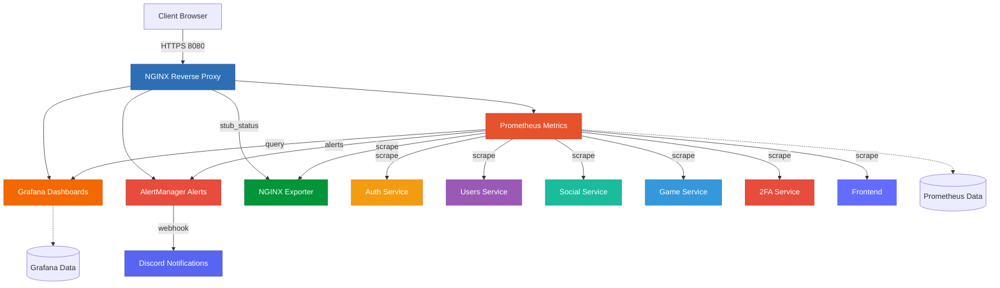
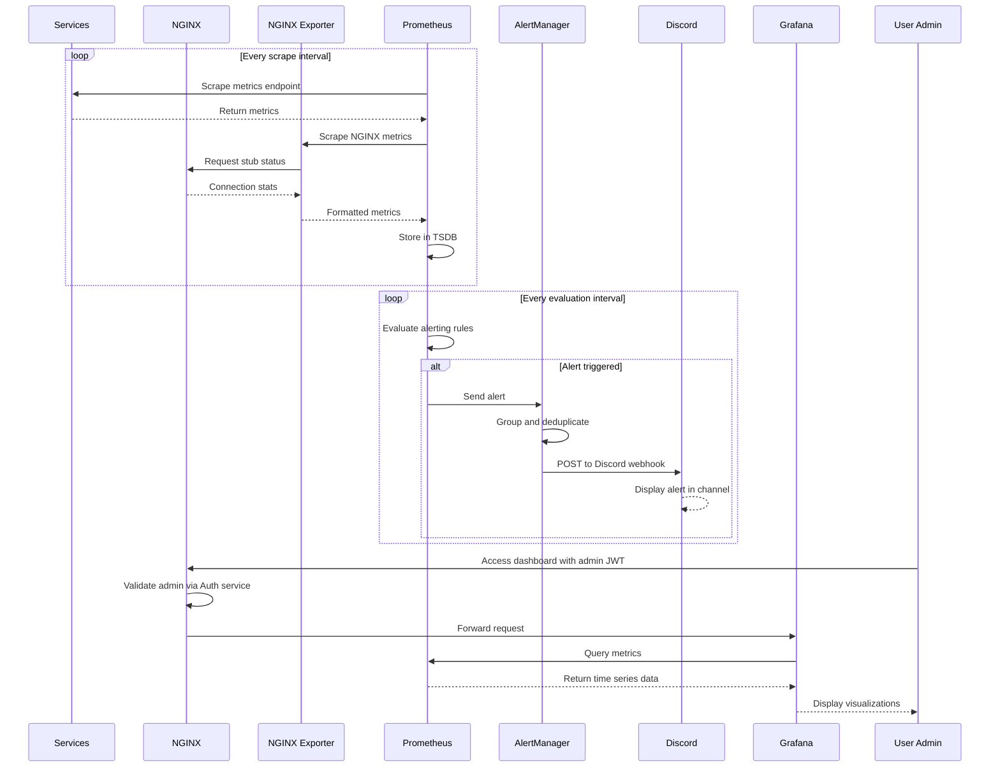

# Monitoring Architecture

## Overview

The monitoring system uses the Prometheus/Grafana stack for metrics collection, visualization and real-time alerting. It includes specialized exporters for detailed infrastructure metrics and Discord integration for alert notifications.

**The monitoring stack is now integrated into the main `docker-compose.yaml` file** and starts automatically with the application.



## Monitoring Stack

### Prometheus

- **Internal port**: 9090
- **External URL**: `https://localhost:8080/prometheus/` (admin authentication required)
- **Role**:
  - Collect metrics from all microservices
  - Collect NGINX metrics via nginx-prometheus-exporter
  - Store in time-series database
  - Evaluate alerting rules
- **Configuration**:
  - `prometheus.yaml`: Configuration of targets to scrape
  - `rules.yaml`: Alerting rules
- **Volume**: `prometheus_data` (metrics persistence)
- **Scraping**: Automatic collection every X seconds

### Grafana

- **Internal port**: 3000
- **External URL**: `https://localhost:8080/grafana/` (admin authentication required)
- **Role**:
  - Visualize Prometheus metrics
  - Create custom dashboards
  - Data exploration
- **Provisioning**:
  - Pre-configured datasources (Prometheus)
  - Pre-configured dashboards (including NGINX dashboard)
- **Volume**: `grafana_data` (config & dashboards persistence)

### AlertManager

- **Internal port**: 9093
- **External URL**: `https://localhost:8080/alertmanager/` (admin authentication required)
- **Role**:
  - Manage and route Prometheus alerts
  - Alert deduplication
  - Grouping and silencing
  - Send notifications via Discord webhook
  - Support for additional notification channels (email, Slack, etc.)
- **Configuration**: Environment variables (. env)
- **Discord Integration**: Configured webhook URL for real-time alerts
- **Dependencies**: Prometheus

### NGINX Prometheus Exporter

- **Internal port**: 9113
- **Exposed port**: 9113 (for external access)
- **Metrics endpoint**: `http://localhost:9113/metrics`
- **Role**:
  - Export NGINX server metrics to Prometheus format
  - Collect connection statistics
  - Monitor request rates and response codes
  - Track upstream server health
- **Configuration**: Connects to NGINX stub_status endpoint (`/stub_status`)
- **Metrics exposed**:
  - Active connections
  - Requests per second
  - Connection states (reading, writing, waiting)
  - Total accepted/handled connections

## Monitoring Flow



## Collected Metrics

### Metrics per Service

Each microservice exposes metrics on the `/metrics` endpoint:

**Standard Metrics:**

- HTTP Requests (Total, Duration, Errors)
- System Metrics (CPU, Memory, Disk)
- Node. js Metrics (Event Loop, Heap)

**Custom Metrics:**

- **Auth**: Login attempts, JWT issued
- **Users**: Active users, Profiles
- **Game**: Games ongoing, Duration, tournament ongoing

**Infrastructure Metrics:**

- **NGINX**: Connections, Requests/s, Response codes

### Metrics Examples

#### Application Metrics

| Metric                          | Type      | Description              |
| ------------------------------- | --------- | ------------------------ |
| `http_request_duration_seconds` | Histogram | HTTP request duration    |
| `http_requests_total`           | Counter   | Total number of requests |
| `nodejs_heap_size_used_bytes`   | Gauge     | Memory used              |
| `auth_login_attempts_total`     | Counter   | Login attempts           |
| `game_sessions_active`          | Gauge     | Active game sessions     |
| `users_registered_total`        | Counter   | Registered users         |

#### NGINX Metrics (via nginx-prometheus-exporter)

| Metric                       | Type    | Description                          |
| ---------------------------- | ------- | ------------------------------------ |
| `nginx_connections_active`   | Gauge   | Current active client connections    |
| `nginx_connections_accepted` | Counter | Total accepted client connections    |
| `nginx_connections_handled`  | Counter | Total handled connections            |
| `nginx_http_requests_total`  | Counter | Total HTTP requests                  |
| `nginx_connections_reading`  | Gauge   | Connections reading request          |
| `nginx_connections_writing`  | Gauge   | Connections writing response         |
| `nginx_connections_waiting`  | Gauge   | Idle connections waiting for request |

## Discord Alert Integration

### Configuration

AlertManager is configured to send alerts to Discord via webhook

### Discord Webhook Setup

1. Create a webhook in your Discord server:
   - Go to Server Settings → Integrations → Webhooks
   - Click "New Webhook"
   - Copy the webhook URL

2. Add to `.env` file:
   ```bash
   DISCORD_WEBHOOK_URL=https://discord.com/api/webhooks/YOUR_WEBHOOK_ID/YOUR_TOKEN
   ```

### Alert Message Format

Discord messages include:

- **Alert Name**: Type of alert triggered
- **Severity**: critical, warning, info
- **Summary**: Brief description
- **Description**: Detailed information
- **Timestamp**: When the alert fired
- **Status**: firing or resolved

Example Discord alert:

```
CRITICAL ALERT

ServiceDown
Service auth is down

Details:
- Instance: auth: 3000
- Duration: 2m
- Status: firing
- Time: 2026-01-04 14:32:15 UTC
```

## Network Architecture

The monitoring system uses two Docker networks:

**monitoring network:**

- Grafana
- AlertManager
- Prometheus
- NGINX Exporter

**backend network:**

- All application services
- NGINX
- Prometheus (bridge)

**External:**

- Discord (via webhook)

## Interface Access

All monitoring interfaces are protected by admin authentication (`/_admin_validate`):

| Service           | URL                                    | Authentication        | Description                 |
| ----------------- | -------------------------------------- | --------------------- | --------------------------- |
| Grafana           | `https://localhost:8080/grafana/`      | Admin JWT required    | Dashboards & visualizations |
| Prometheus        | `https://localhost:8080/prometheus/`   | Admin JWT required    | PromQL query interface      |
| AlertManager      | `https://localhost:8080/alertmanager/` | Admin JWT required    | Alert management            |
| NGINX Exporter    | `http://localhost:9113/metrics`        | Public (port exposed) | NGINX metrics endpoint      |

**Note**: You need to be logged in as an admin user to access Grafana, Prometheus, and AlertManager interfaces.

## Testing Alerts

### Verify NGINX Metrics

```bash
# Check NGINX stub_status (requires being inside the Docker network)
docker exec nginx wget -qO- http://localhost:8080/stub_status

# Check NGINX exporter metrics (public)
curl http://localhost:9113/metrics | grep nginx_
```

**Monitoring Best Practices**

This monitoring setup follows industry standards:

- Time-series metrics collection with Prometheus
- Rich visualization with Grafana
- Intelligent alerting with AlertManager
- Infrastructure monitoring with specialized exporters
- Real-time notifications via Discord
- Service-level and business-level metrics
- Non-intrusive integration
- Scalable architecture
- Admin-only access for security
- Fully integrated with main application stack
