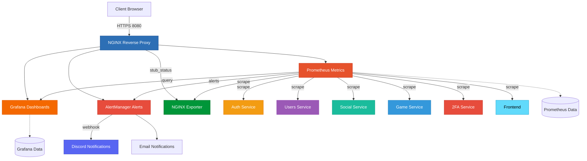
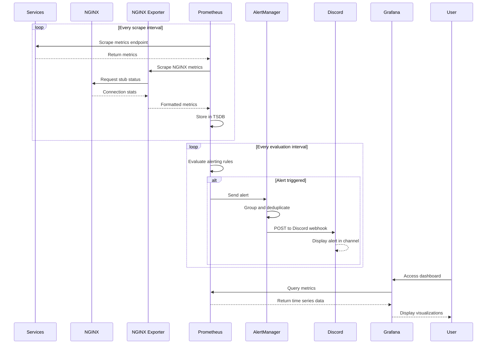

# Monitoring Architecture

## Overview

The monitoring system uses the Prometheus/Grafana stack for metrics collection, visualization and real-time alerting. It includes specialized exporters for detailed infrastructure metrics and Discord integration for alert notifications.



## Monitoring Stack

### Prometheus

- **Internal port**: 9090
- **External URL**: `http://localhost:8080/prometheus/`
- **Role**:
  - Collect metrics from all microservices
  - Collect NGINX metrics via nginx-prometheus-exporter
  - Store in time-series database
  - Evaluate alerting rules
- **Configuration**:
  - `prometheus.yaml`: Configuration of targets to scrape
  - `rules.yaml`: Alerting rules
- **Volume**: `prometheus_data` (metrics persistence)
- **Scraping**: Automatic collection every X seconds

### Grafana

- **Internal port**: 3000
- **External URL**: `http://localhost:8080/grafana/` (via NGINX)
- **Role**:
  - Visualize Prometheus metrics
  - Create custom dashboards
  - Data exploration
- **Provisioning**:
  - Pre-configured datasources (Prometheus)
  - Pre-configured dashboards (including NGINX dashboard)
- **Volume**: `grafana_data` (config & dashboards persistence)

### AlertManager

- **Internal port**: 9093
- **Role**:
  - Manage and route Prometheus alerts
  - Alert deduplication
  - Grouping and silencing
  - Send notifications via Discord webhook
  - Support for additional notification channels (email, Slack, etc.)
- **Configuration**: Environment variables (. env)
- **Discord Integration**: Configured webhook URL for real-time alerts
- **Dependencies**: Prometheus

### NGINX Prometheus Exporter

- **Internal port**: 9113
- **Metrics endpoint**: `http://nginx-exporter:9113/metrics`
- **Role**:
  - Export NGINX server metrics to Prometheus format
  - Collect connection statistics
  - Monitor request rates and response codes
  - Track upstream server health
- **Configuration**: Connects to NGINX stub_status endpoint
- **Metrics exposed**:
  - Active connections
  - Requests per second
  - Connection states (reading, writing, waiting)
  - Total accepted/handled connections

## Monitoring Flow



## Collected Metrics

### Metrics per Service

Each microservice exposes metrics on the `/metrics` endpoint:

**Standard Metrics:**

- HTTP Requests (Total, Duration, Errors)
- System Metrics (CPU, Memory, Disk)
- Node.js Metrics (Event Loop, Heap)

**Custom Metrics:**

- **Auth**: Login attempts, JWT issued
- **Users**: Active users, Profiles
- **Game**: Games played, Duration
- **Social**: Messages, Friends

**Infrastructure Metrics:**

- **NGINX**: Connections, Requests/s, Response codes

### Metrics Examples

#### Application Metrics

| Metric                          | Type      | Description              |
| ------------------------------- | --------- | ------------------------ |
| `http_request_duration_seconds` | Histogram | HTTP request duration    |
| `http_requests_total`           | Counter   | Total number of requests |
| `nodejs_heap_size_used_bytes`   | Gauge     | Memory used              |
| `auth_login_attempts_total`     | Counter   | Login attempts           |
| `game_sessions_active`          | Gauge     | Active game sessions     |
| `users_registered_total`        | Counter   | Registered users         |

#### NGINX Metrics (via nginx-prometheus-exporter)

| Metric                       | Type    | Description                          |
| ---------------------------- | ------- | ------------------------------------ |
| `nginx_connections_active`   | Gauge   | Current active client connections    |
| `nginx_connections_accepted` | Counter | Total accepted client connections    |
| `nginx_connections_handled`  | Counter | Total handled connections            |
| `nginx_http_requests_total`  | Counter | Total HTTP requests                  |
| `nginx_connections_reading`  | Gauge   | Connections reading request          |
| `nginx_connections_writing`  | Gauge   | Connections writing response         |
| `nginx_connections_waiting`  | Gauge   | Idle connections waiting for request |

## Alerting Rules

Example rules configured in `rules.yaml`:

```yaml
groups:
  - name: service_alerts
    rules:
      # High error rate
      - alert: HighErrorRate
        expr: rate(http_requests_total{status=~"5.."}[5m]) > 0.05
        for: 5m
        labels:
          severity: critical
        annotations:
          summary: 'High error rate on service'
          description: 'Service is experiencing high error rate'

      # Service down
      - alert: ServiceDown
        expr: up{job="microservices"} == 0
        for: 2m
        labels:
          severity: critical
        annotations:
          summary: 'Service is down'
          description: 'Service has been down for more than 2 minutes'

      # High memory usage
      - alert: HighMemoryUsage
        expr: nodejs_heap_size_used_bytes / nodejs_heap_size_total_bytes > 0.9
        for: 5m
        labels:
          severity: warning
        annotations:
          summary: 'High memory usage on service'
          description: 'Memory usage is critically high'

      # NGINX high connection rate
      - alert: NginxHighConnectionRate
        expr: rate(nginx_connections_accepted[5m]) > 100
        for: 5m
        labels:
          severity: warning
        annotations:
          summary: 'High connection rate on NGINX'
          description: 'NGINX is accepting high number of connections per second'

      # NGINX connection handling issues
      - alert: NginxConnectionHandlingIssues
        expr: (nginx_connections_accepted - nginx_connections_handled) > 0
        for: 5m
        labels:
          severity: warning
        annotations:
          summary: 'NGINX is dropping connections'
          description: 'Connections have been accepted but not handled'
```

## Discord Alert Integration

### Configuration

AlertManager is configured to send alerts to Discord via webhook:

```yaml
# alertmanager.yml
receivers:
  - name: 'discord'
    webhook_configs:
      - url: '${DISCORD_WEBHOOK_URL}'
        send_resolved: true

route:
  receiver: 'discord'
  group_by: ['alertname', 'severity']
  group_wait: 10s
  group_interval: 10s
  repeat_interval: 1h
```

### Discord Webhook Setup

1. Create a webhook in your Discord server:
   - Go to Server Settings → Integrations → Webhooks
   - Click "New Webhook"
   - Copy the webhook URL

2. Add to `.env` file:
   ```bash
   DISCORD_WEBHOOK_URL=https://discord.com/api/webhooks/YOUR_WEBHOOK_ID/YOUR_TOKEN
   ```

### Alert Message Format

Discord messages include:

- **Alert Name**: Type of alert triggered
- **Severity**: critical, warning, info
- **Summary**: Brief description
- **Description**: Detailed information
- **Timestamp**: When the alert fired
- **Status**: firing or resolved

Example Discord alert:

```
CRITICAL ALERT

ServiceDown
Service auth is down

Details:
- Instance: auth 3000
- Duration: 2m
- Status: firing
- Time: 2026-01-02 14:32:15 UTC
```

## Network Architecture

The monitoring system uses two Docker networks:

**monitoring network:**

- Grafana
- AlertManager
- Prometheus
- NGINX Exporter

**backend network:**

- All application services
- NGINX
- Prometheus (bridge)
- NGINX Exporter (bridge)

**External:**

- Discord (via webhook)

## Grafana Dashboards

### Dashboard: Services Overview

- **Metrics**: Availability, latency, error rate
- **Services**: Auth, Users, Social, Game, 2FA, Frontend

### Dashboard: System Resources

- **Metrics**: CPU, RAM, Disk I/O
- **Per service**: Individual consumption

### Dashboard: NGINX Performance

- **Metrics**:
  - Active connections
  - Requests per second
  - Connection states (reading, writing, waiting)
  - Request/response rates
  - Upstream server status
- **Visualizations**: Time series graphs, gauges, stat panels

### Dashboard: Business Metrics

- **Auth**: Logins/day, active tokens
- **Users**: New users, modified profiles
- **Game**: Games played, average duration
- **Social**: Messages sent, friends added

## Docker Compose Configuration

### Monitoring Services

```yaml
services:
  prometheus:
    image: prom/prometheus:v3.7.3
    ports:  9090
    volumes:
      - prometheus_data:/prometheus
      - ./prometheus.yaml:/etc/prometheus/prometheus.yml: ro
      - ./rules.yaml:/etc/prometheus/rules.yml:ro
    command:
      - '--config.file=/etc/prometheus/prometheus.yml'
      - '--web.route-prefix=/prometheus'
      - '--web.external-url=http://localhost:8080/prometheus/'

  grafana:
    image:   grafana/grafana-oss:12.2.0
    ports:  3000
    volumes:
      - grafana_data:/var/lib/grafana
      - ./provisioning:/etc/grafana/provisioning: ro
      - ./dashboards:/etc/grafana/dashboards:ro

  alertmanager:
    build:  ./alertmanager
    ports:  9093
    env_file:
      - .env
    environment:
      - DISCORD_WEBHOOK_URL=${DISCORD_WEBHOOK_URL}
    depends_on:
      - prometheus

  nginx-exporter:
    image:  nginx/nginx-prometheus-exporter: latest
    ports:  9113
    command:
      - '-nginx.scrape-uri=http://nginx:8080/stub_status'
    depends_on:
      - nginx
    networks:
      - backend
      - monitoring
```

## Interface Access

| Service        | URL                                   | Description                 |
| -------------- | ------------------------------------- | --------------------------- |
| Grafana        | `http://localhost:8080/grafana/`      | Dashboards & visualizations |
| Prometheus     | `http://localhost:8080/prometheus/`   | PromQL query interface      |
| AlertManager   | `http://localhost:8080/alertmanager/` | Alert management            |
| NGINX Exporter | `http://localhost:9113/metrics`       | NGINX metrics endpoint      |

## Monitoring Healthchecks

All monitoring services have healthchecks:

- **Interval**: 30s
- **Timeout**: 3s
- **Retries**: 5
- **Start period**: 10s

## Startup Order (Monitoring)

1. **Application services** (Auth, Users, etc.)
2. **NGINX** (reverse proxy)
3. **NGINX Exporter** (depends on NGINX)
4. **Prometheus** (depends on services for scraping)
5. **AlertManager** (depends on Prometheus)
6. **Grafana** (depends on Prometheus)

## Persistent Volumes

| Volume            | Usage                | Service    |
| ----------------- | -------------------- | ---------- |
| `prometheus_data` | Time-series database | Prometheus |
| `grafana_data`    | Dashboards & config  | Grafana    |

## Integration with Main Architecture

The monitoring integrates non-intrusively:

- No application code modification required
- Expose a `/metrics` endpoint per service
- NGINX stub_status module for infrastructure metrics
- Automatic scraping by Prometheus
- Centralized visualization in Grafana
- Proactive alerting via AlertManager
- Real-time Discord notifications

## Getting Started

### Build monitoring stack

```bash
make build-monitoring
```

### Start monitoring with application

```bash
make up-monitoring
```

This command will:

- Verify environment variables (. env file)
- Start all application services
- Start monitoring stack (Prometheus, Grafana, AlertManager, NGINX Exporter)

### Stop all services

```bash
make down
```

## Useful Commands

### View logs from specific services

```bash
# View Prometheus logs
make logs-prometheus

# View Grafana logs
make logs-grafana

# View AlertManager logs
make logs-alertmanager

# View NGINX Exporter logs
make logs-nginx-exporter
```

### Access service shell

```bash
# Access Grafana shell
make sh-grafana

# Access Prometheus shell
make sh-prometheus
```

### Direct Docker commands

```bash
# Reload Prometheus config
docker exec prometheus kill -HUP 1

# Test NGINX exporter manually
curl http://localhost:9113/metrics

# Check NGINX stub_status
curl http://localhost:8080/stub_status
```

## Testing Alerts

### Test Discord Integration

```bash
# Trigger a test alert manually
curl -X POST http://localhost:9093/api/v1/alerts -d '[
  {
    "labels":  {
      "alertname": "TestAlert",
      "severity": "warning"
    },
    "annotations": {
      "summary": "Test alert for Discord integration",
      "description": "This is a test alert"
    }
  }
]'
```

### Verify NGINX Metrics

```bash
# Check NGINX stub_status
curl http://localhost:8080/stub_status

# Check NGINX exporter metrics
curl http://localhost:9113/metrics | grep nginx_
```

## Troubleshooting

### Check service status

```bash
# List all running containers
docker ps

# Check specific service logs
make logs-prometheus
make logs-grafana
make logs-alertmanager
```

### Restart monitoring stack

```bash
# Stop all services
make down

# Rebuild monitoring stack
make build-monitoring

# Start monitoring
make up-monitoring
```

### Reset environment

```bash
# Stop all services and remove volumes
make down
make reset-db

# Rebuild and restart
make build-monitoring
make up-monitoring
```

---

**Monitoring Best Practices**

This monitoring setup follows industry standards:

- Time-series metrics collection with Prometheus
- Rich visualization with Grafana
- Intelligent alerting with AlertManager
- Infrastructure monitoring with specialized exporters
- Real-time notifications via Discord
- Service-level and business-level metrics
- Non-intrusive integration
- Scalable architecture

```

```
