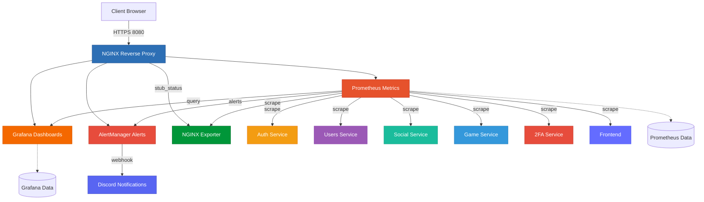
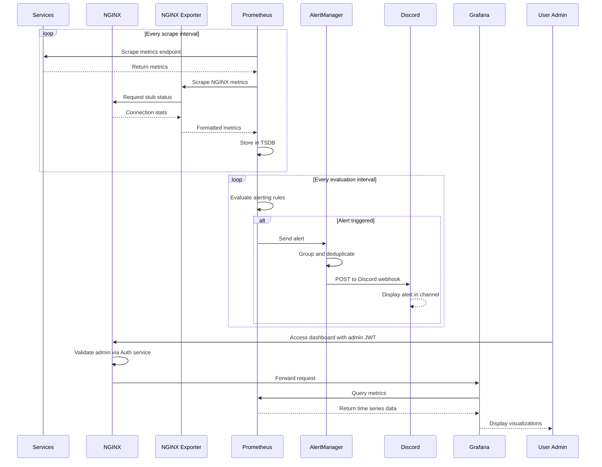

# Monitoring Architecture

## Overview

The monitoring system uses the Prometheus/Grafana stack for metrics collection, visualization and real-time alerting.  It includes specialized exporters for detailed infrastructure metrics and Discord integration for alert notifications.

**The monitoring stack is now integrated into the main `docker-compose.yaml` file** and starts automatically with the application.



## Monitoring Stack

### Prometheus
- **Internal port**: 9090
- **External URL**: `https://localhost:8080/prometheus/` (admin authentication required)
- **Role**: 
  - Collect metrics from all microservices
  - Collect NGINX metrics via nginx-prometheus-exporter
  - Store in time-series database
  - Evaluate alerting rules
- **Configuration**:
  - `prometheus.yaml`: Configuration of targets to scrape
  - `rules.yaml`: Alerting rules
- **Volume**:  `prometheus_data` (metrics persistence)
- **Scraping**:  Automatic collection every X seconds

### Grafana
- **Internal port**: 3000
- **External URL**: `https://localhost:8080/grafana/` (admin authentication required)
- **Role**:
  - Visualize Prometheus metrics
  - Create custom dashboards
  - Data exploration
- **Provisioning**:
  - Pre-configured datasources (Prometheus)
  - Pre-configured dashboards (including NGINX dashboard)
- **Volume**: `grafana_data` (config & dashboards persistence)

### AlertManager
- **Internal port**: 9093
- **External URL**: `https://localhost:8080/alertmanager/` (admin authentication required)
- **Role**:
  - Manage and route Prometheus alerts
  - Alert deduplication
  - Grouping and silencing
  - Send notifications via Discord webhook
  - Support for additional notification channels (email, Slack, etc.)
- **Configuration**:  Environment variables (. env)
- **Discord Integration**:  Configured webhook URL for real-time alerts
- **Dependencies**: Prometheus

### NGINX Prometheus Exporter
- **Internal port**: 9113
- **Exposed port**: 9113 (for external access)
- **Metrics endpoint**: `http://localhost:9113/metrics`
- **Role**:
  - Export NGINX server metrics to Prometheus format
  - Collect connection statistics
  - Monitor request rates and response codes
  - Track upstream server health
- **Configuration**:  Connects to NGINX stub_status endpoint (`/stub_status`)
- **Metrics exposed**:
  - Active connections
  - Requests per second
  - Connection states (reading, writing, waiting)
  - Total accepted/handled connections

## Monitoring Flow



## Collected Metrics

### Metrics per Service

Each microservice exposes metrics on the `/metrics` endpoint:

**Standard Metrics:**
- HTTP Requests (Total, Duration, Errors)
- System Metrics (CPU, Memory, Disk)
- Node. js Metrics (Event Loop, Heap)

**Custom Metrics:**
- **Auth**:  Login attempts, JWT issued
- **Users**: Active users, Profiles
- **Game**: Games played, Duration
- **Social**:  Messages, Friends

**Infrastructure Metrics:**
- **NGINX**: Connections, Requests/s, Response codes

### Metrics Examples

#### Application Metrics

| Metric | Type | Description |
|--------|------|-------------|
| `http_request_duration_seconds` | Histogram | HTTP request duration |
| `http_requests_total` | Counter | Total number of requests |
| `nodejs_heap_size_used_bytes` | Gauge | Memory used |
| `auth_login_attempts_total` | Counter | Login attempts |
| `game_sessions_active` | Gauge | Active game sessions |
| `users_registered_total` | Counter | Registered users |

#### NGINX Metrics (via nginx-prometheus-exporter)

| Metric | Type | Description |
|--------|------|-------------|
| `nginx_connections_active` | Gauge | Current active client connections |
| `nginx_connections_accepted` | Counter | Total accepted client connections |
| `nginx_connections_handled` | Counter | Total handled connections |
| `nginx_http_requests_total` | Counter | Total HTTP requests |
| `nginx_connections_reading` | Gauge | Connections reading request |
| `nginx_connections_writing` | Gauge | Connections writing response |
| `nginx_connections_waiting` | Gauge | Idle connections waiting for request |

## Alerting Rules

Example rules configured in `rules.yaml`:

```yaml
groups:
  - name: service_alerts
    rules:
      # High error rate
      - alert: HighErrorRate
        expr: rate(http_requests_total{status=~"5.."}[5m]) > 0. 05
        for: 5m
        labels:  
          severity: critical
        annotations:
          summary:  "High error rate on service"
          description: "Service is experiencing high error rate"
      
      # Service down
      - alert: ServiceDown
        expr: up{job="microservices"} == 0
        for: 2m
        labels:
          severity: critical
        annotations:
          summary: "Service is down"
          description: "Service has been down for more than 2 minutes"
      
      # High memory usage
      - alert: HighMemoryUsage
        expr:  nodejs_heap_size_used_bytes / nodejs_heap_size_total_bytes > 0.9
        for: 5m
        labels:
          severity: warning
        annotations:
          summary:  "High memory usage on service"
          description: "Memory usage is critically high"
      
      # NGINX high connection rate
      - alert: NginxHighConnectionRate
        expr:  rate(nginx_connections_accepted[5m]) > 100
        for: 5m
        labels:
          severity: warning
        annotations:
          summary:  "High connection rate on NGINX"
          description: "NGINX is accepting high number of connections per second"
      
      # NGINX connection handling issues
      - alert: NginxConnectionHandlingIssues
        expr: (nginx_connections_accepted - nginx_connections_handled) > 0
        for: 5m
        labels:
          severity: warning
        annotations:
          summary:  "NGINX is dropping connections"
          description: "Connections have been accepted but not handled"
```

## Discord Alert Integration

### Configuration

AlertManager is configured to send alerts to Discord via webhook:  

```yaml
# alertmanager.yml
receivers:
  - name: 'discord'
    webhook_configs:
      - url: '${DISCORD_WEBHOOK_URL}'
        send_resolved: true

route:
  receiver: 'discord'
  group_by: ['alertname', 'severity']
  group_wait: 10s
  group_interval: 10s
  repeat_interval: 1h
```

### Discord Webhook Setup

1. Create a webhook in your Discord server:  
   - Go to Server Settings → Integrations → Webhooks
   - Click "New Webhook"
   - Copy the webhook URL

2. Add to `.env` file:
   ```bash
   DISCORD_WEBHOOK_URL=https://discord.com/api/webhooks/YOUR_WEBHOOK_ID/YOUR_TOKEN
   ```

### Alert Message Format

Discord messages include:
- **Alert Name**: Type of alert triggered
- **Severity**: critical, warning, info
- **Summary**: Brief description
- **Description**: Detailed information
- **Timestamp**: When the alert fired
- **Status**: firing or resolved

Example Discord alert:  
```
CRITICAL ALERT

ServiceDown
Service auth is down

Details:
- Instance: auth: 3000
- Duration: 2m
- Status: firing
- Time: 2026-01-04 14:32:15 UTC
```

## Network Architecture

The monitoring system uses two Docker networks:  

**monitoring network:**
- Grafana
- AlertManager
- Prometheus
- NGINX Exporter

**backend network:**
- All application services
- NGINX
- Prometheus (bridge)

**External:**
- Discord (via webhook)

## Grafana Dashboards

### Dashboard:  Services Overview
- **Metrics**:  Availability, latency, error rate
- **Services**: Auth, Users, Social, Game, 2FA, Frontend

### Dashboard: System Resources
- **Metrics**: CPU, RAM, Disk I/O
- **Per service**: Individual consumption

### Dashboard: NGINX Performance
- **Metrics**:
  - Active connections
  - Requests per second
  - Connection states (reading, writing, waiting)
  - Request/response rates
  - Upstream server status
- **Visualizations**:  Time series graphs, gauges, stat panels

### Dashboard: Business Metrics
- **Auth**:  Logins/day, active tokens
- **Users**: New users, modified profiles
- **Game**: Games played, average duration
- **Social**: Messages sent, friends added

## Docker Compose Configuration

### Monitoring Services

The monitoring stack is defined directly in `docker-compose.yaml`:

```yaml
services:
  prometheus:
    image: prom/prometheus: v3.7.3
    container_name: prometheus
    restart: on-failure
    networks:
      - backend
      - monitoring
    depends_on:
      auth:
        condition: service_healthy
      users:
        condition:  service_healthy
    volumes:  
      - prometheus_data:/prometheus
      - ./services/monitoring/prometheus/prometheus.yaml:/etc/prometheus/prometheus.yml: ro
      - ./services/monitoring/prometheus/rules.yaml:/etc/prometheus/rules.yml:ro
    command:
      - '--config.file=/etc/prometheus/prometheus.yml'
      - '--storage.tsdb.path=/prometheus'
      - '--web.route-prefix=/prometheus'
      - '--web.external-url=http://localhost:8080/prometheus/'

  grafana:
    image:  grafana/grafana-oss:12.2.0-17142428006
    container_name: grafana
    restart: on-failure
    networks:
      - monitoring
    volumes:  
      - grafana_data:/var/lib/grafana
      - ./services/monitoring/grafana/provisioning:/etc/grafana/provisioning:ro
      - ./services/monitoring/grafana/dashboards:/etc/grafana/dashboards:ro
    depends_on:
      prometheus:
        condition: service_healthy
    env_file:
      - . env

  alertmanager:
    build: 
      context: ./services/monitoring/alertmanager
      dockerfile: Dockerfile
    container_name: alertmanager
    restart: on-failure
    networks: 
      - monitoring
    env_file:
      - .env
    depends_on:
      prometheus: 
        condition: service_healthy
    entrypoint: /entrypoint.sh

  nginx-exporter:
    image: nginx/nginx-prometheus-exporter:1.5.1
    container_name: nginx-exporter
    command:  
      - '-nginx.scrape-uri=http://nginx: 8080/stub_status'
    ports:
      - '9113:9113'
    depends_on:
      - nginx
    networks:
      - monitoring
    restart: on-failure
```

## Interface Access

All monitoring interfaces are protected by admin authentication (`/_admin_validate`):

| Service | URL | Authentication | Description |
|---------|-----|----------------|-------------|
| Grafana | `https://localhost:8080/grafana/` | Admin JWT required | Dashboards & visualizations |
| Prometheus | `https://localhost:8080/prometheus/` | Admin JWT required | PromQL query interface |
| AlertManager | `https://localhost:8080/alertmanager/` | Admin JWT required | Alert management |
| NGINX Exporter | `http://localhost:9113/metrics` | Public (port exposed) | NGINX metrics endpoint |
| NGINX stub_status | `https://localhost:8080/stub_status` | Internal network only | NGINX status page |

**Note**: You need to be logged in as an admin user to access Grafana, Prometheus, and AlertManager interfaces. 

## Monitoring Healthchecks

All monitoring services have healthchecks:   
- **Interval**: 30s
- **Timeout**: 3s
- **Retries**:  5
- **Start period**: 10s

## Startup Order (Monitoring)

1. **Application services** (Auth, Users, etc.)
2. **Prometheus** (depends on services for scraping)
3. **AlertManager** (depends on Prometheus)
4. **Grafana** (depends on Prometheus)
5. **NGINX** (depends on all services including AlertManager)
6. **NGINX Exporter** (depends on NGINX)

## Persistent Volumes

| Volume | Usage | Service |
|--------|-------|---------|
| `prometheus_data` | Time-series database | Prometheus |
| `grafana_data` | Dashboards & config | Grafana |

## Integration with Main Architecture

The monitoring is now **fully integrated** into the main build: 
- No separate docker-compose file needed
- Starts automatically with `make up`
- No application code modification required
- Expose a `/metrics` endpoint per service
- NGINX stub_status module for infrastructure metrics
- Automatic scraping by Prometheus
- Centralized visualization in Grafana
- Proactive alerting via AlertManager
- Real-time Discord notifications
- Admin authentication for all monitoring interfaces

## Useful Commands

### Start application with monitoring

```bash
# Start all services (monitoring included)
make up

# View monitoring service logs
make logs-prometheus
make logs-grafana
make logs-alertmanager
make logs-nginx-exporter
```

### Access monitoring shells

```bash
# Access Grafana shell
make sh-grafana

# Access Prometheus shell
make sh-prometheus
```

### Monitoring-specific operations

```bash
# Reload Prometheus config
docker exec prometheus kill -HUP 1

# Test NGINX exporter manually
curl http://localhost:9113/metrics

# Check NGINX stub_status (from inside the network)
docker exec nginx wget -qO- http://localhost:8080/stub_status

# Access Grafana shell
docker exec -it grafana /bin/bash
```

## Testing Alerts

### Test Discord Integration

```bash
# Trigger a test alert manually
curl -X POST http://localhost:9093/api/v1/alerts -d '[
  {
    "labels": {
      "alertname": "TestAlert",
      "severity": "warning"
    },
    "annotations": {
      "summary":  "Test alert for Discord integration",
      "description": "This is a test alert"
    }
  }
]'
```

### Verify NGINX Metrics

```bash
# Check NGINX stub_status (requires being inside the Docker network)
docker exec nginx wget -qO- http://localhost:8080/stub_status

# Check NGINX exporter metrics (public)
curl http://localhost:9113/metrics | grep nginx_
```

## Troubleshooting

### Check monitoring service status

```bash
# List all running containers (including monitoring)
docker ps

# Check specific monitoring service logs
make logs-prometheus
make logs-grafana
make logs-alertmanager
```

### Cannot access monitoring interfaces

1. Verify you are logged in as an admin user
2. Check that NGINX is running and healthy
3. Verify admin validation endpoint is working: 
   ```bash
   make logs-nginx
   make logs-auth
   ```

### Restart monitoring stack

```bash
# Stop all services
make down

# Start again (monitoring included)
make up
```

### Reset monitoring data

```bash
# Stop all services and remove volumes
make down
make reset-db

# Rebuild and restart
make build
make up
```

---

**Monitoring Best Practices**

This monitoring setup follows industry standards: 
- Time-series metrics collection with Prometheus
- Rich visualization with Grafana
- Intelligent alerting with AlertManager
- Infrastructure monitoring with specialized exporters
- Real-time notifications via Discord
- Service-level and business-level metrics
- Non-intrusive integration
- Scalable architecture
- Admin-only access for security
- Fully integrated with main application stack
```